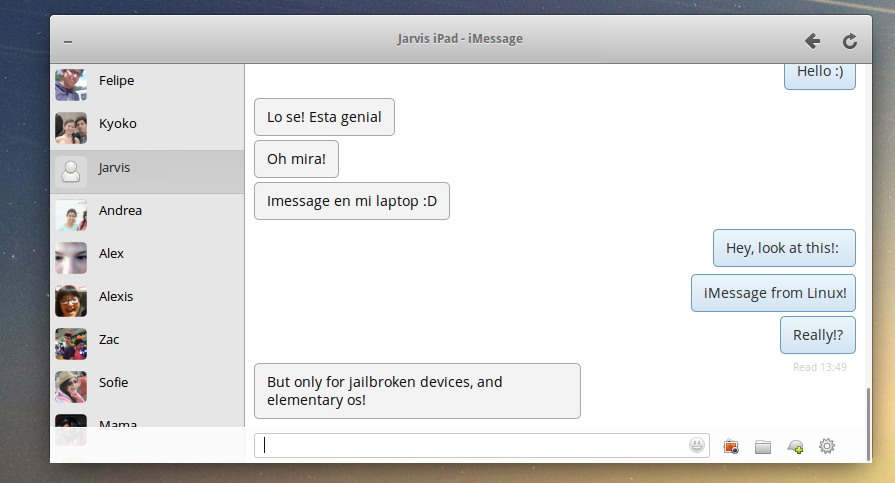

# iViewer

iViewer is an iMessage client for elementary OS. Remote messages is a tweak for jailbroken iDevices that allowes you to access your iMessages from a web browser. With this app, remote messages can easly and seamlessly integrate with the elementary desktop. With it you can receive notifications, and you can have up to 3 different devices "registered" for quick and easy access one click access. It also contains a theme for the tweak so the application will look and feel like a native elementary app. [Here](https://plus.google.com/116970085465259483479/videos?pid=6108073479399775314&oid=116970085465259483479) is a quick explination on how it works 

## Instalation 

1. Jailbreak your idevice, install the "Remote Messages" tweak and enable it from your settings
2. Place the iViewer folder in /usr/share/
3. In the iViewer folder, execute:
  * sudo cp org.felipe.iViewer.gschema.xml /usr/share/glib-2.0/schemas/
  * sudo glib-compile-schemas /usr/share/glib-2.0/schemas/
  * sudo apt-get install libwebkit2gtk-3.0-25

## How to compile this app

In case the executables aren't working for you: 

* sudo apt-get install libwebkit2gtk-3.0-dev
* sudo apt-get build-dep granite-demo pantheon-calculator
* cp /usr/share/vala-0.26/vapi/webkit2gtk-4.0.vapi /usr/share/vala-0.26/vapi/webkit2gtk-3.0.vapi
* cp /usr/share/vala-0.26/vapi/webkit2gtk-4.0.deps /usr/share/vala-0.26/vapi/webkit2gtk-3.0.deps
* valac-0.26 --pkg gtk+-3.0 --pkg webkit2gtk-3.0 --pkg libnotify --pkg granite --thread --target-glib 2.32 iViewer.vala
* sudo cp org.felipe.iViewer.xml /usr/share/glib-2.0/schemas/
* sudo glib-compile-schemas /usr/share/glib-2.0/schemas/

## Special thanks to:

- Kay van der Zander and Nicolas Laplante: For their help with vala 
- Daniel Fore: For his chat mockup
- Micah Ilbery: For the Awesome icon

